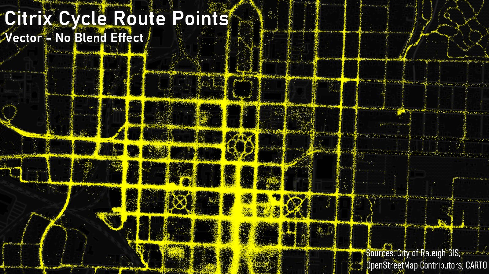
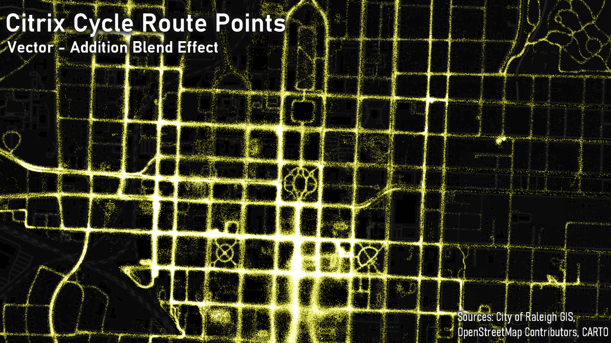
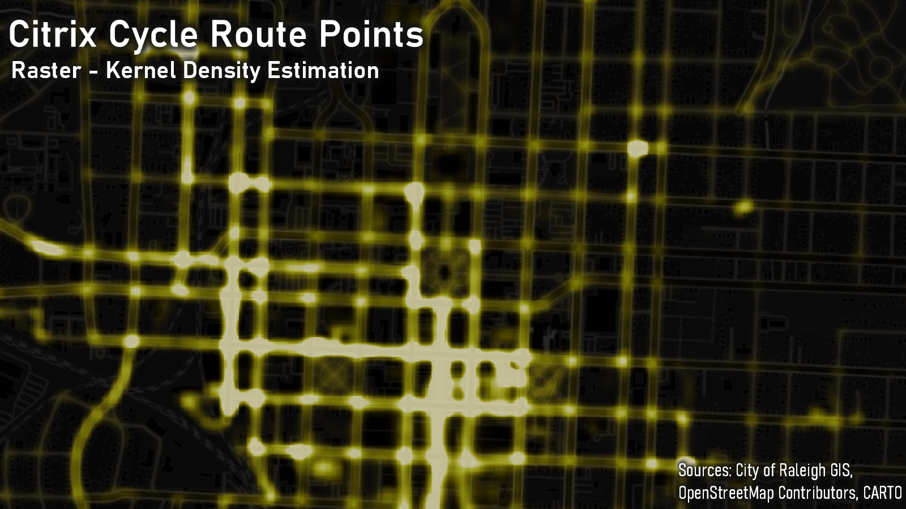
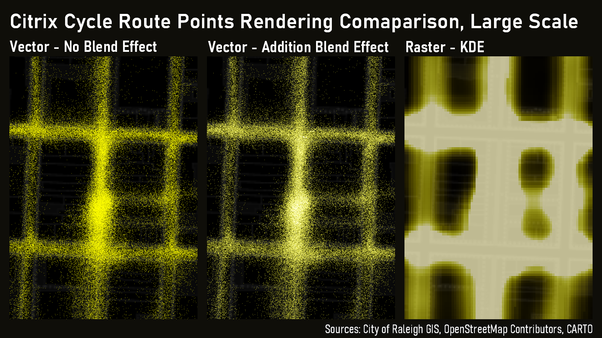
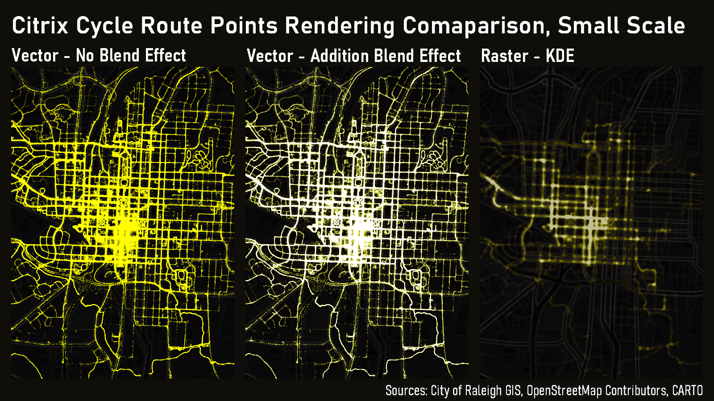

# Day 5: Raster

For hexagon day yesterday, [I aggregated all the vertices of each Citrix Cycle ride to regular 5 acre hexagons](day-04-hexagons.html). For today's map I decided to see what that data would look like aggregated to pixel cells. I used the Kerned Density Estimation (KDE) Processing tool in QGIS to create a raster layer of vertex density for all rides. It created a much different look compared to the raw point data. This put me down a rabbit hole to do some visual comparisons of representing these veritces as points versus as KDE raster. I'm not super-savvy when it comes to rasters and there are a lot of different settings and approaches to mapping density that, given the time constraints of this challenge, I did not delve into. What follows are some not particularly technical musings about 3 different rendering approaches for this point data.

First I just mapped the raw point data as just solid-filled points. Looking at this, it looks like pretty much every street downtown is equally dense with Citrix Cycle traffic. This isn't a great representation of this data if you're interested in point density.

Then I added an Addition blend effect for each feature in the point representation. As markers overlap, the move gradually from yellow to bright white. This does draw out some more variation in density of points! However, I should note that there are over 1 million points in this dataset and it does take a bit of time to render the whole layer. Not the end of the world, but if I wanted to serve this data as web map, it'd be really villainous to force users to download that much data.

Finally I, ran the data through the KDE tool. This creates a pretty interesting view of the data that gives you a general sense of the variation in point density across the dataset. It's also a pretty small dataset. Much better for serving over the web.

It's also interesting to compare these different rendering modes across different scales. Because of the lower resolution of the KDE raster, I kind of like the points with Addition blend mode better.

Zooming out, the usefulness of that blend effect seems to decrease because when you get to smaller scales more and more points are occupying the same pixels. The KDE layer look doesn't really change because its rendering is based on the data values of the pixels in the KDE raster layer. It also renders much faster!

