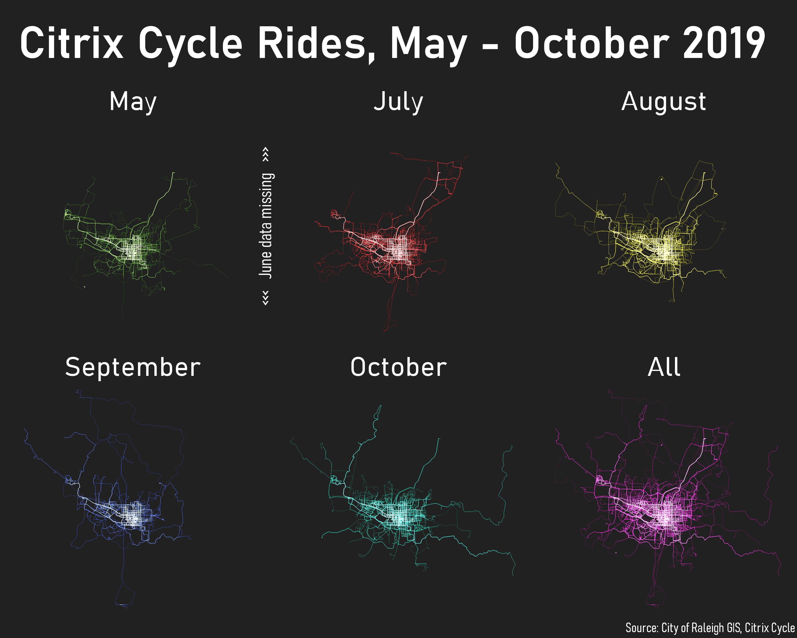

# Day 2: Lines

For today's prompt I decided to map a new favorite dataset. Back in April, the City of Raleigh's bike share program, Citrix Cycle, launched. I haven't used as I prefer riding my own bike, but by all accounts it's a great service. My interest is in the data collected when the bikes are in use. I stumbled upon the live feed for Citrix Cycle rides on ArcGIS Online. There's a lot one can do with this dataset and I suspect I'll use it for other map in this challenge. For Day 2, however, I've just let the geometries speak for themselves.




I did some preprocessing with Python, the ArcGIS Python API, and geopandas to access and clean up the data.

```Python
from datetime import datetime
import geopandas as gpd
from arcgis.gis import GIS
gis = GIS()

# Accessed the data using the ArcGIS Python API
cc_item = gis.content.get('4d4930c1981f41fc864e26616193e64f')
cc_flayer = cc_item.layers[0]
cc_fset = cc_flayer.query()

# I prefer geopandas for working with data in Python so I did this silly step of converting the ArcGIS feature set into a GeoDataFrame.
cc_gdf = gpd.read_file(cc_fset.to_geojson)

# I am not good at working with time, so I converted the unlockedAt timestamps into the a column containing just the name of the month when each ride took place
cc_gdf["Month"] = cc_gdf.apply(lambda x: datetime.fromtimestamp(int(str(x["unlockedAt"])[:-3])).strftime('%B'), axis = 1)

# Reduced the number of fields to some that might be interesting to have around and export to GeoJSON 
cc_reduced_gdf = cc_gdf[['OBJECTID', 'startStationName', 'endStationName', 'unlockedAt', 'lockedAt', 'duration', 'Month', 'geometry']]
cc_reduced_gdf.to_file('cc_30DayMapChallenge.geojson', driver = 'GeoJSON')
```

I loaded the data into QGIS where I made 6 copies of the routes layer, each filtered by month and layed out in a sort of nod to small multiples. I love QGIS's feature and layer rendering modes. By adding some opacity to each feature and applying a Screen blending mode to each feature, the areas of heavy cycle traffic emerge in a bright white.

On to Day 3!