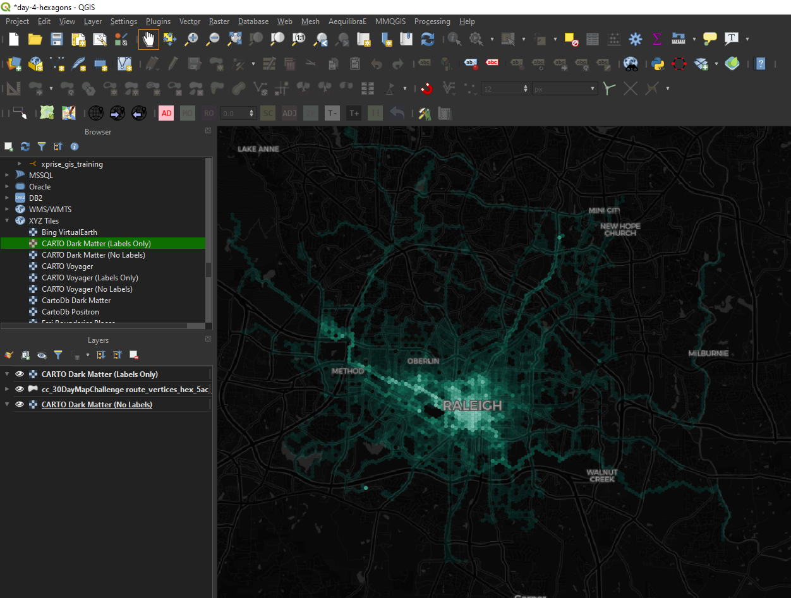

# Day 4: Hexagons

Citrix Cycle data returns! Today's map uses the same data from [Day 2](day-02-lines.html), but represented in a different way. Using QGIS, I extracted all the vertices from each Citrix Cycle ride lines. I happened to have a 5 acre hexagon grid layer for Raleigh handy so yet again I called upon QGIS to count how many vertices landed in each hexagon. I styled the hexagons using a custom teal color ramp where low traffic areas appear more transparent and darker while higher traffic areas show up as brighter and more opaque. Here's the map in QGIS:

For this map, I wanted tip my hat to [Tom Chadwin](https://twitter.com/tomchadwin), [Riccardo Klinger](https://twitter.com/ricckli), and all the other folks who have contributed to the [qgis2web](https://github.com/tomchadwin/qgis2web) plugin for QGIS. I used this excellent plugin to quickly publish a fully functioning Leaflet-based map based on my project in QGIS. Although I feel fairly comfortable using Leaflet to make this kind of map myself, this plugin is lowers the barrier to both for producing an interactive web map and for learning how to write code for your own custom applications.

<iframe src="../embeds/day-04-hexagons/index.html" width=100% height=700vh></iframe>

 My map today is not particularly remarkable so I encourage you to instead go and read [Tom's write-up on the history of the qgis2web plugin](https://tom.chadw.in/wrote/qgis2webTheStorySoFar) and check out Riccardo's excellent site, [digital-geograph.com](http://www.digital-geography.com/).