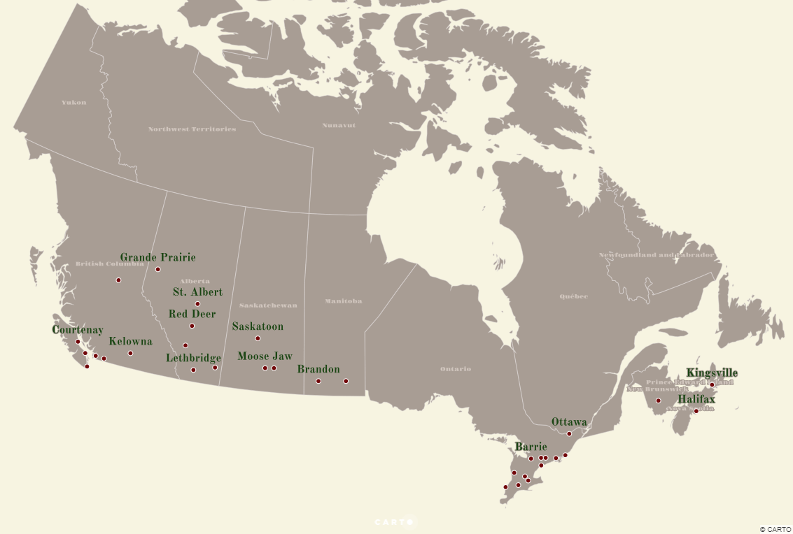

# Day 6: Red

I remember back in the late-90s, after watching _Wishbone_ and _Where in the World is Carmen Sandiego?_ on my local PBS station, there would be this strange show where a flannel-clad man in a bucket hat would, among other things, coming up with comedic hacks to household chores. This was the strange world of _The Red Green Show_. It was a distinclty Candian show that despite being pretty dumb, was charming. I haven't watched _The Red Green Show_ in over 20 years, but when I was thinking about what to map for my Day 6 map, I suddenly had a memory of this show. I discovered that not only does Red Green hace a website, but he also tours! I found a list of his 2019 tour dates which included information about the date and location of each show. Through the combined magic of copy & paste and find & replace in Notepad, I was able to create a CSV containing a record of each tour stop.

Admittedly, it's not the most interesting data, so I decided I'd use this opportunity to try and do some non-Web Mercator web mapping. I'd considered using D3.js - I may do so for another map - but I recalled that CARTO had at one time published a tutorial on non-Web Mercator web mapping. Sure enough, I found [this great post from Mamata Akella written way back in 2015 on this topic](https://carto.com/blog/free-your-maps-web-mercator/). CARTO has changed quite a bit since then, but because PostGIS is the backbone of CARTO, the workflow Mamata described worked with minimal adjustment.

For my map,I imported my CSV of Red Green tour dates, which were then geocoded by CARTO. I also added Canadian provincial boundaries from [Natural Earth Data](http://www.naturalearthdata.com/). I wanted to use the North America Albers Equal Area Conic projection, but CARTO's PostGIS implementation does not come with this projection included. Following Mamata's guide I copied the SQL definition for this projection from [epsg.io](http://epsg.io/102008). From there it was just a matter of using PostGIS's `ST_TRANSFORM()` to transform the geometry column for both the tour dates and Natural Earth data from Web Mercator to North America Albers Equal Area Conic. For styling, I opted for something simple, albeit unnecessarily elegant within the Red Green-verse.

I've opted to only embed an image of this map as the actual performance of the interactive version is not great. If you'd like to check for yourself, you can here [here](https://maptastik.carto.com/builder/f8ee6ca9-354b-405f-a5d5-3701d98720d5/embed).

## Check out _The Red Green Show_

<iframe width="560" height="315" src="https://www.youtube.com/embed/5RM6JJb3azE" frameborder="0" allow="accelerometer; autoplay; encrypted-media; gyroscope; picture-in-picture" allowfullscreen></iframe>