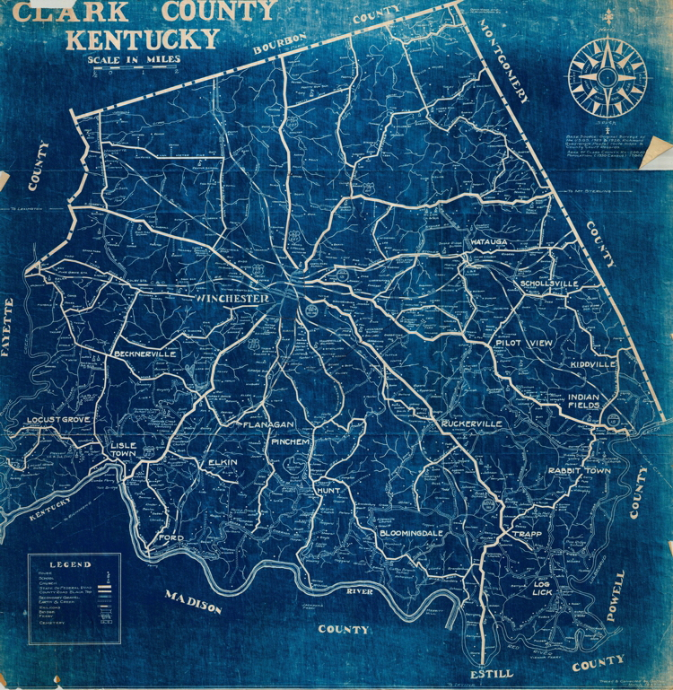
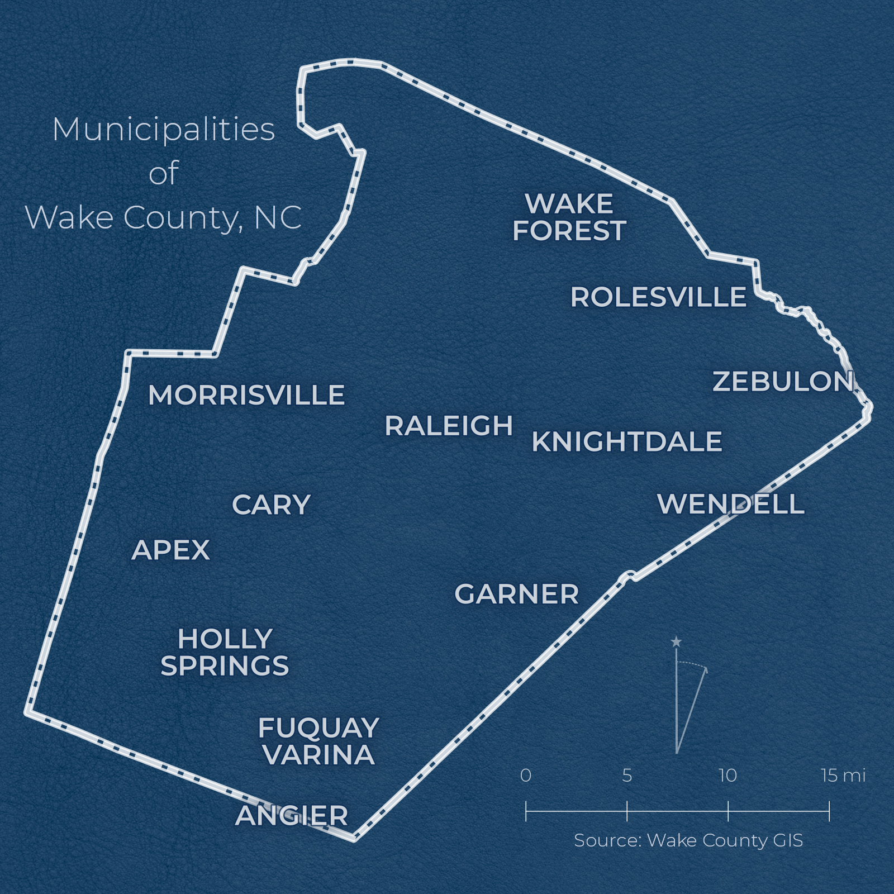

# Day 8: Blue

I had originally intended to make a map related to the Bluegrass Region of Kentucky. However, in my search for different definitions of "The Bluegrass", I came across a really cool map on the [Bluegrass Heritage Museums' website](http://www.bgheritage.com/) of Clark County, Kentucky. 

Published in 1937, I believe the blue-white color scheme is less a product of a cartographic movement and stems more from graphic print technique called [blueprint](https://en.wikipedia.org/wiki/Blueprint).

I decided to use this map as inspiration for a simple map of municipalities of Wake County, North Carolina. Everything in this map was done using QGIS and data from [Wake County's Open Data site](https://data.wakegov.com/).

