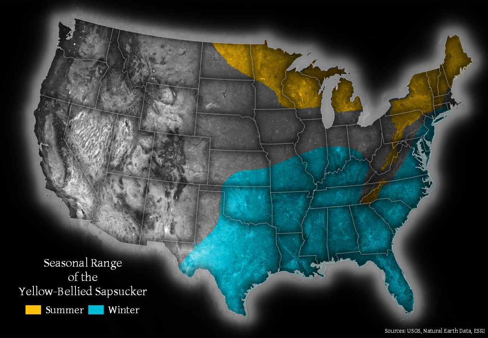

# Day 9: Yellow

I've tried to set some time limits on my maps and posts so I'll keep this short. For my Day 9 map I've created a map of the range of the [Yellow-Bellied Sapsucker](https://en.wikipedia.org/wiki/Yellow-bellied_sapsucker) using [data](https://www.sciencebase.gov/catalog/item/59f5e239e4b063d5d307dd57) created as a part of the US Geological Survey's  [Gap Analysis Project](https://www.sciencebase.gov/catalog/item/5951527de4b062508e3b1e79) of species ranges.

