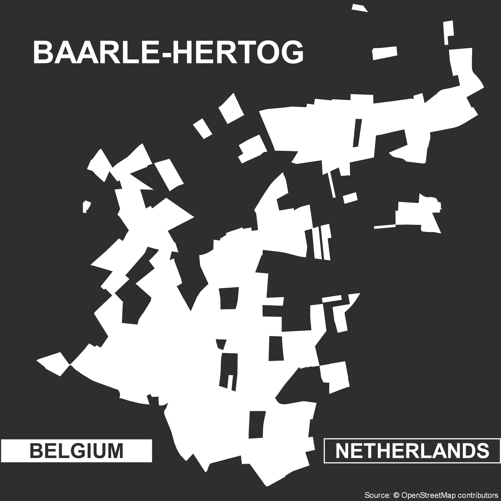

# Day 10: Black & White

The strict binary in today's theme, black and white, to me presents the challenge of conveying complex information in the simplest way possible. However, binaries themselves have the potential to highlight complexity . Take for example, the border between the Netherlands and Belgium at the town of [Baarle-Hertog](https://en.wikipedia.org/wiki/Baarle-Hertog). This town is subverts our expectations about borders as demarcations of in and out by nesting borders within border. My map today simply represents the Belgian and Dutch land in this town and in the process, I hope, complicates the viewers own notions of in and out.

